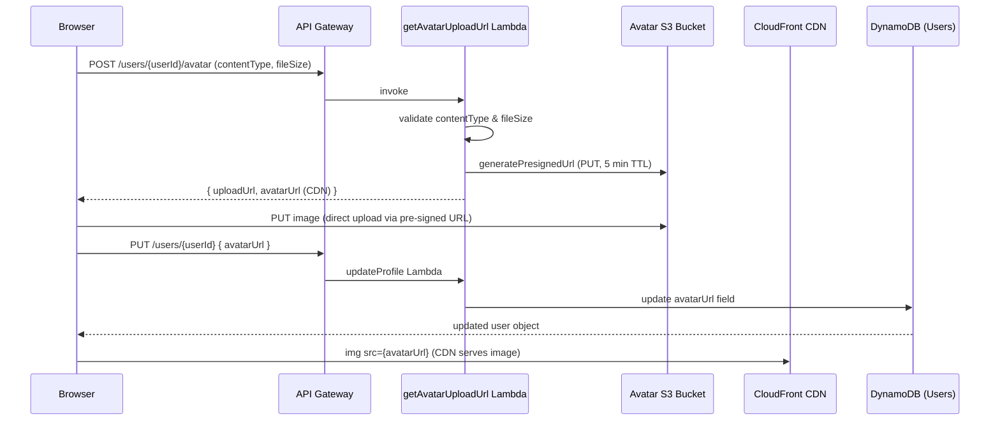

# Design Document: User Avatars

## Overview

This feature adds profile picture (avatar) support to the micro-blogging application. Users can upload a JPEG, PNG, or GIF image (up to 5 MB) directly from their profile page. Uploaded images are stored in a dedicated S3 bucket and served via CloudFront CDN. A reusable `Avatar` React component renders either the user's image or an initials-based fallback wherever avatars appear — currently in the feed's post cards and on profile pages.

The upload flow uses a pre-signed S3 URL pattern: the backend Lambda generates a time-limited PUT URL, the browser uploads directly to S3 (bypassing the API Gateway payload limit), and a separate confirmation call updates the user's `avatarUrl` in DynamoDB.

## Architecture



**Key design decisions:**

- Direct-to-S3 upload avoids the 10 MB API Gateway payload limit and reduces Lambda execution time/cost.
- The existing `updateProfile` Lambda already accepts `avatarUrl` as an allowed field, so no new backend endpoint is needed for the DynamoDB write — only the pre-signed URL generation requires a new Lambda.
- A single `Avatar` component handles all rendering contexts via a `size` prop (`"sm"` = 40×40, `"lg"` = 80×80).
- The Avatar S3 bucket is separate from the website hosting bucket, with all public access blocked; CloudFront is the sole delivery mechanism.

## Components and Interfaces

### New Backend Lambda: `getAvatarUploadUrl`

**Path:** `backend/src/functions/users/getAvatarUploadUrl.js`  
**Route:** `POST /users/{userId}/avatar`  
**Auth:** `withAuth` middleware (authenticated users only)

Request body:
```json
{ "contentType": "image/jpeg", "fileSize": 1048576 }
```

Response (200):
```json
{
  "uploadUrl": "https://s3.amazonaws.com/avatar-bucket/...",
  "avatarUrl": "https://d1234.cloudfront.net/avatars/{userId}"
}
```

Error responses:
- `400` — invalid `contentType` or `fileSize` exceeds 5 MB
- `401` — unauthenticated
- `403` — requesting a URL for a different user's avatar

The Lambda uses `@aws-sdk/client-s3` with `PutObjectCommand` and `getSignedUrl` from `@aws-sdk/s3-request-presigner` to generate the pre-signed URL. The S3 key is `avatars/{userId}` (overwriting on re-upload). The returned `avatarUrl` is the CloudFront CDN URL for that key.

### New Frontend Component: `Avatar`

**Path:** `frontend/src/components/Avatar.tsx`

```typescript
interface AvatarProps {
  user: Pick<User, 'displayName' | 'avatarUrl'>;
  size: 'sm' | 'lg'; // sm = 40x40, lg = 80x80
}
```

Renders an `` when `avatarUrl` is set, with an `onError` handler that switches to the initials fallback. The initials fallback is a styled `<div>` showing up to 2 uppercase initials derived from `displayName` (first letter of each word).

**Initials derivation:** split `displayName` on whitespace, take the first letter of each token, uppercase, join, truncate to 2 characters. Empty/whitespace names fall back to `"?"`.

### Modified Frontend Pages

- **`Feed.tsx`** — add `<Avatar user={post.user} size="sm" />` inside each post card's header.
- **`Profile.tsx`** — add `<Avatar user={user} size="lg" />` in the profile header; add avatar upload control (file input + upload button) visible only when `isOwnProfile`.

### New Frontend Service Method

Added to `usersApi` in `frontend/src/services/api.ts`:

```typescript
getAvatarUploadUrl: async (
  userId: string,
  contentType: string,
  fileSize: number,
  token: string
): Promise<{ uploadUrl: string; avatarUrl: string }>
```

### Infrastructure Changes (`app-stack.ts`)

1. New S3 bucket: `AvatarBucket` — `BlockPublicAccess.BLOCK_ALL`, CORS policy allowing PUT from app origins.
2. New CloudFront distribution (or behavior on existing): serves `AvatarBucket` with `maxTtl: Duration.days(1)`.
3. New Lambda: `GetAvatarUploadUrlFunction` — granted `s3:PutObject` on `AvatarBucket` and `dynamodb:GetItem` on `UsersTable`.
4. New API route: `POST /users/{userId}/avatar` → `GetAvatarUploadUrlFunction`.

## Data Models

### DynamoDB Users Table — no schema change

The `avatarUrl` field already exists as an optional string on the `User` type and is already an allowed field in `updateProfile.js`. No migration needed.

```typescript
// Existing User type (frontend/src/types/user.ts) — unchanged
interface User {
  id: string;
  username: string;
  email: string;
  displayName: string;
  bio?: string;
  avatarUrl?: string;   // CDN URL, e.g. "https://d1234.cloudfront.net/avatars/{userId}"
  createdAt?: string;
  updatedAt?: string;
  followersCount?: number;
  followingCount?: number;
}
```

### S3 Object Key Convention

```
avatars/{userId}          # e.g. avatars/abc-123-def
```

One object per user; re-uploading overwrites the existing key. The CDN URL is deterministic: `https://{avatarCdnDomain}/avatars/{userId}`.

### Environment Variables (new)

| Variable | Used by | Value |
|---|---|---|
| `AVATAR_BUCKET_NAME` | `getAvatarUploadUrl` Lambda | S3 bucket name |
| `AVATAR_CDN_DOMAIN` | `getAvatarUploadUrl` Lambda | CloudFront domain |
| `VITE_AVATAR_CDN_URL` | Frontend (optional, for display) | CloudFront base URL |

## Correctness Properties

*A property is a characteristic or behavior that should hold true across all valid executions of a system — essentially, a formal statement about what the system should do. Properties serve as the bridge between human-readable specifications and machine-verifiable correctness guarantees.*

### Property 1: Backend MIME type validation rejects non-allowed types

*For any* string passed as `contentType` to the avatar upload URL endpoint, the validation function SHALL accept it if and only if it is one of `"image/jpeg"`, `"image/png"`, or `"image/gif"`, and reject all other values with a 400 response.

**Validates: Requirements 1.2**

---

### Property 2: Backend file size validation rejects oversized files

*For any* numeric value passed as `fileSize`, the validation function SHALL accept it if and only if it is greater than 0 and less than or equal to 5,242,880 bytes (5 MB), and reject all other values with a 400 response.

**Validates: Requirements 1.3**

---

### Property 3: Authorization — users may only request upload URLs for their own avatar

*For any* authenticated user with ID `A` making a request to generate a pre-signed URL for user ID `B`, the request SHALL succeed (200) if and only if `A === B`, and return 403 for all cases where `A !== B`.

**Validates: Requirements 1.5**

---

### Property 4: Initials derivation correctness

*For any* non-empty `displayName` string, the initials extraction function SHALL return a string of 1–2 uppercase characters where each character is the first letter of a whitespace-delimited word in the name, taken left-to-right.

**Validates: Requirements 2.2, 3.2**

---

### Property 5: Avatar component renders at the correct dimensions for its size prop

*For any* `User` object and any valid `size` prop value (`"sm"` or `"lg"`), the `Avatar` component SHALL render its root element with width and height equal to 40 pixels when `size="sm"` and 80 pixels when `size="lg"`, regardless of whether an `avatarUrl` is set.

**Validates: Requirements 2.4, 3.1, 3.2**

---

### Property 6: Client-side file validation accepts only valid type and size combinations

*For any* `File` object, the client-side validation function SHALL return valid if and only if the file's `type` is one of `"image/jpeg"`, `"image/png"`, `"image/gif"` AND its `size` is ≤ 5,242,880 bytes; it SHALL return invalid (with a descriptive error) for all other combinations.

**Validates: Requirements 4.2, 4.3**

## Error Handling

| Scenario | Behavior |
|---|---|
| Invalid MIME type (backend) | 400 with `{ message: "Invalid file type. Allowed: image/jpeg, image/png, image/gif" }` |
| File too large (backend) | 400 with `{ message: "File size exceeds 5 MB limit" }` |
| Unauthenticated request | 401 (handled by `withAuth` middleware) |
| Requesting URL for another user | 403 with `{ message: "You can only upload your own avatar" }` |
| S3 pre-signed URL generation failure | 500 with generic error message |
| Invalid MIME type (client) | Inline error message shown; no API call made |
| File too large (client) | Inline error message shown; no API call made |
| Pre-signed URL request fails | Error message shown; upload control re-enabled |
| S3 PUT upload fails | Error message shown; upload control re-enabled; `avatarUrl` not updated |
| Avatar image fails to load in `` | `onError` handler switches to initials fallback |
| `displayName` is empty or whitespace | Initials fallback renders `"?"` |

## Testing Strategy

### Unit Tests

Focus on pure logic that is fast to test in isolation:

- `Avatar` component rendering: with `avatarUrl` set, without `avatarUrl`, with image load error
- Initials extraction function: single word, two words, three+ words, empty string, whitespace-only
- Client-side file validation function: valid files, invalid MIME types, oversized files, boundary values (exactly 5 MB)
- `getAvatarUploadUrl` Lambda handler: valid request, invalid MIME type, oversized file, wrong user ID, unauthenticated

### Property-Based Tests

Use [fast-check](https://github.com/dubzzz/fast-check) (already available in the JS ecosystem) with a minimum of 100 iterations per property.

Each property test references its design property via a comment tag:
`// Feature: user-avatars, Property {N}: {property_text}`

- **Property 1** — Generate arbitrary strings as `contentType`; assert the validation function returns `true` iff the value is in the allowed set.
- **Property 2** — Generate arbitrary integers (including negatives, zero, boundary values); assert the validation function returns `true` iff `0 < fileSize <= 5_242_880`.
- **Property 3** — Generate pairs of UUIDs `(requesterId, targetId)`; assert the authorization check returns `allowed` iff they are equal.
- **Property 4** — Generate arbitrary non-empty strings as `displayName`; assert the initials function returns 1–2 uppercase letters matching the first character of each word.
- **Property 5** — Generate arbitrary `User` objects (with and without `avatarUrl`) and `size` values; assert the rendered element dimensions match the expected pixel values.
- **Property 6** — Generate arbitrary `{ type: string, size: number }` objects; assert the client-side validator accepts iff type is in the allowed set AND size ≤ 5,242,880.

### Integration Tests

- End-to-end upload flow: authenticated user requests pre-signed URL → uploads to S3 → confirms via `updateProfile` → `getProfile` returns updated `avatarUrl`.
- CDK snapshot test: verify `AvatarBucket` has `BlockPublicAccess.BLOCK_ALL`, CORS allows PUT, CloudFront behavior has `maxTtl` of 1 day, and two distinct S3 buckets exist in the stack.
